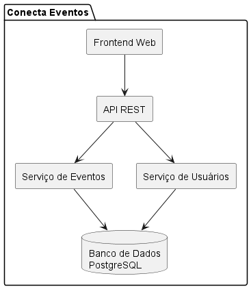
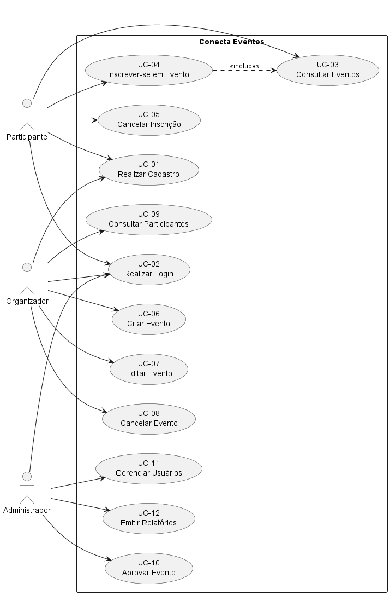
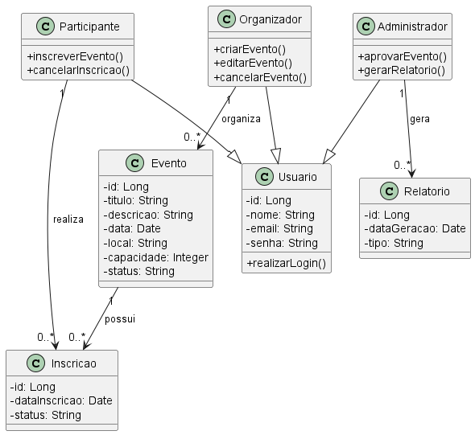
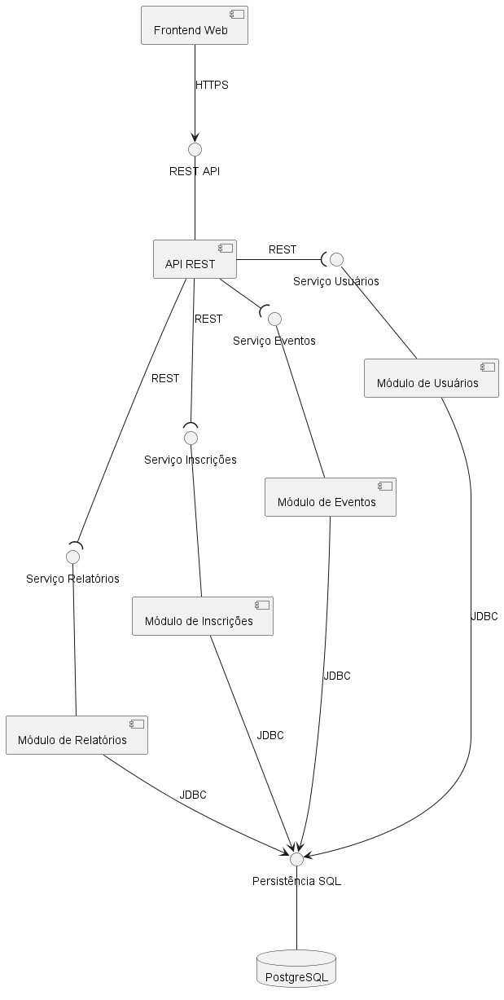
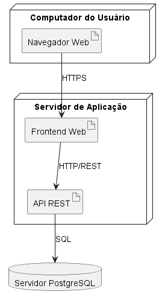
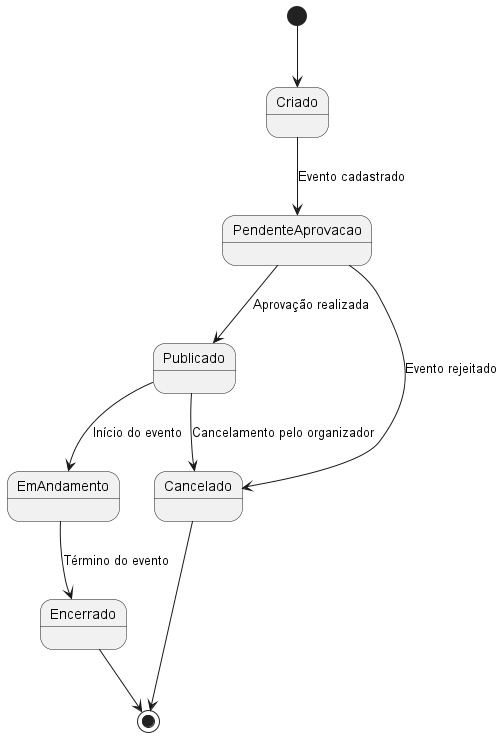
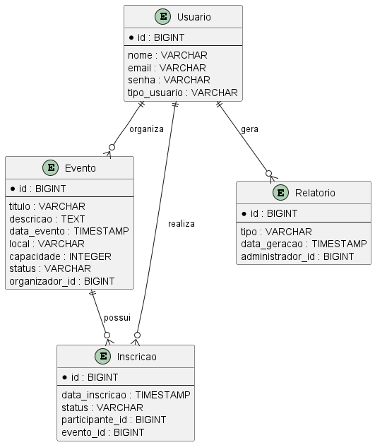

# 🎉 Conecta Eventos

> Sistema para gerenciamento de eventos, permitindo o cadastro, organização, divulgação e participação em eventos de diferentes categorias.

---

## 📚 Sobre o Projeto

O Conecta Eventos é um sistema desenvolvido como projeto acadêmico da disciplina de Projeto de Software.

O objetivo da aplicação é facilitar a gestão de eventos por meio de uma plataforma centralizada onde organizadores podem criar e administrar eventos, participantes podem realizar inscrições e administradores podem supervisionar o funcionamento da plataforma.

Este projeto contempla apenas a fase de análise e projeto do sistema, incluindo requisitos, arquitetura, modelagem UML e modelo de dados.

---

## 🎯 Objetivos

- Gerenciar eventos;
- Controlar inscrições;
- Permitir autenticação de usuários;
- Gerenciar participantes;
- Aprovar eventos;
- Emitir relatórios gerenciais.

---

## 👥 Atores do Sistema

### Participante
- Consultar eventos;
- Realizar inscrições;
- Cancelar inscrições.

### Organizador
- Criar eventos;
- Editar eventos;
- Cancelar eventos;
- Consultar participantes.

### Administrador
- Aprovar eventos;
- Gerenciar usuários;
- Emitir relatórios.

---

## ⚙️ Tecnologias Utilizadas

### Modelagem

- UML
- PlantUML

### Banco de Dados

- PostgreSQL

### Back-end (proposto)

- Java 21
- Spring Boot

### Front-end (proposto)

- React
- Vite

---

## 🏛️ Arquitetura

O sistema segue uma arquitetura em camadas composta por:

- Frontend Web
- API REST
- Serviços de Negócio
- Banco de Dados PostgreSQL

### Diagrama de Arquitetura



---

## 📊 Diagramas UML

### Casos de Uso



### Classes



### Componentes



### Implantação



### Estado



### Entidade Relacionamento



---

## 📂 Estrutura do Projeto

```text
Conecta-Eventos
│
├── Diagramas
│   ├── Diagrama de comunicação
│   ├── Diagrama de sequencia detalhado
│   ├── Diagrama de sequencia do sistema
│   ├── Diagrama-de-arquitetura.png
│   ├── Diagrama-de-casos-de-uso.png
│   ├── Diagrama-de-classes.png
│   ├── Diagrama-de-componentes.png
│   ├── Diagrama-de-estado.png
│   ├── Diagrama-de-implantacao.png
│   └── Diagrama-Entidade-Relacionamento.png
│
├── PlantUML
│   ├── Diagrama de comunicação
│   ├── Diagrama de sequencia detalhado
│   └── Diagrama de sequencia do sistema
│
├── LICENSE
└── README.md
```
## 📝 Principais Casos de Uso
ID	Caso de Uso
UC-01	Realizar Cadastro
UC-02	Realizar Login
UC-03	Consultar Eventos
UC-04	Inscrever-se em Evento
UC-05	Cancelar Inscrição
UC-06	Criar Evento
UC-07	Editar Evento
UC-08	Cancelar Evento
UC-09	Consultar Participantes
UC-10	Aprovar Evento
UC-11	Gerenciar Usuários
UC-12	Emitir Relatórios

## 👨‍💻 Autor
Nome
Matheus Dias Mendes

## 📄 Licença

Este projeto foi desenvolvido para fins acadêmicos na disciplina de Projeto de Software.